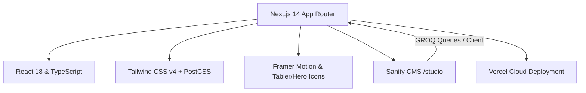

# 🔶 Society of Hispanic Professional Engineers (SHPE) @ UIUC Official Website

Welcome to the official repository for the **SHPE UIUC Chapter Website** ([shpe-website-ten.vercel.app](https://shpe-website-ten.vercel.app/))! 🚀

This project is built, maintained, and continuously enhanced by the **UIUC SHPE Tech Team** and is open to the entire UIUC SHPE community to contribute, learn, and collaborate.

---

## 📖 Table of Contents
- [About This Project](#-about-this-project)
- [Community & Open Source Philosophy](#-community--open-source-philosophy)
- [Architecture & Tech Stack](#-architecture--tech-stack)
  - [Framework & Routing](#framework--routing)
  - [Styling & UI](#styling--ui)
  - [Content Management (CMS)](#content-management-cms)
  - [Animations & Motion](#animations--motion)
  - [Hosting & Deployment](#hosting--deployment)
- [Project Structure](#-project-structure)
- [Getting Started (Local Development)](#-getting-started-local-development)
- [Contributing Guide](#-contributing-guide)
- [Tech Team & Contact](#-tech-team--contact)

---

## 💡 About This Project

The SHPE UIUC website is the digital front door for our chapter at the **University of Illinois Urbana-Champaign Grainger College of Engineering**. It serves as a central hub for:
- Connecting new, current, and prospective members with chapter resources and committees.
- Showcasing upcoming events and Google Calendar synchronization.
- Highlighting corporate sponsors and sponsorship packages.
- Elevating **SHPEtinas** and member spotlights.
- Managing leadership profiles and committee information via Sanity Studio CMS.

---

## 🤝 Community & Open Source Philosophy

This codebase is open to all **UIUC SHPE members**! Whether you are an experienced software engineer or a first-year member looking to get your hands dirty with real-world web development:
- **Learn by Doing:** Get hands-on experience with modern tech stacks: Next.js (App Router), TypeScript, Tailwind CSS, Framer Motion, and Headless CMS (Sanity).
- **Submit PRs:** Found a typo? Want to improve an animation, add an interactive feature, or optimize performance? Fork the repo and make a PR!
- **Mentorship:** Tech committee leads and fellow members are here to help review code and guide your contributions.

---

## 🏗️ Architecture & Tech Stack



### Framework & Routing
- **[Next.js 14](https://nextjs.org/) (App Router)**: Utilizing server-side rendering (SSR), static generation (SSG), and React Server Components (RSC) for blazing fast load times and clean file-based routing under `/app`.
- **[React 18](https://react.dev/) & [TypeScript](https://www.typescriptlang.org/)**: Strongly typed components and data models.

### Styling & UI
- **[Tailwind CSS v4](https://tailwindcss.com/)**: Utility-first CSS configured in `@import "tailwindcss";` with custom theme variables for UIUC and SHPE brand colors:
  - `shpe-blue` (`#001E44`) & `shpe-orange` (`#F75521`)
  - `uiuc-blue` (`#13294B`) & `uiuc-orange` (`#FF5F05`)
  - `shpetinas-pink` (`#FFC0CB`)
- **[Heroicons](https://heroicons.com/) & [Tabler Icons](https://tabler-icons.io/)**: Crisp SVG iconography across the application.

### Content Management (CMS)
- **[Sanity.io Studio v3](https://www.sanity.io/)**: Headless CMS integrated directly under `/studio` for non-developer board members to easily update:
  - Executive Board Profiles (`/sanity/schemas/executiveBoard.ts`)
  - Committee Information (`/sanity/schemas/committee.ts`)
  - SHPEtinas Leadership & Spotlights (`/sanity/schemas/shpetina.ts`, `/sanity/schemas/shpetinaSpotlight.ts`)

### Animations & Motion
- **[Framer Motion](https://www.framer.com/motion/)**: Smooth scroll-triggered fade-ins (`FadeIn.tsx`), responsive interactive elements, and micro-animations.

### Hosting & Deployment
- **[Vercel](https://vercel.com/)**: Continuous integration and deployment with automated preview branches on pull requests.

---

## 📁 Project Structure

```text
SHPE_Website/
├── app/                      # Next.js 14 App Router pages & layouts
│   ├── components/           # Reusable UI components (Navbar, Footer, FlameEasterEgg, Cards, etc.)
│   ├── contact/              # Contact page with executive board directory & forms
│   ├── events/               # Calendar and event integration
│   ├── get-involved/         # Committee listings & leadership opportunities
│   ├── join/                 # Step-by-step onboarding guide for new members
│   ├── resources/            # Member resources, study banks & links
│   ├── shpetinas/            # SHPEtinas committee & spotlight page
│   ├── sponsors/             # Corporate sponsor tiers & brochures
│   ├── studio/               # Embedded Sanity Studio CMS interface
│   ├── globals.css           # Global Tailwind CSS and design tokens
│   ├── layout.tsx            # Root layout with SEO metadata & structure
│   └── page.tsx              # Homepage with hero carousel, pillars & quick links
├── sanity/                   # Sanity CMS configuration & schema definitions
│   ├── schemas/              # Content schemas (executiveBoard, committee, etc.)
│   ├── env.ts                # Sanity project ID & dataset variables
│   └── schema.ts             # Schema index
├── public/                   # Static assets (logos, sponsor logos, carousel images)
├── package.json              # Dependencies and scripts
└── tsconfig.json             # TypeScript configuration
```

---

## 🚀 Getting Started (Local Development)

### 1. Prerequisites
- **Node.js** (v18.17 or later recommended)
- **npm** (or `pnpm` / `yarn`)
- **Git**

### 2. Clone the repository
```bash
git clone https://github.com/SHPE-UIUC/SHPE_OFFICIAL_WEBSITE.git
cd SHPE_OFFICIAL_WEBSITE/SHPE_Website
```

### 3. Install dependencies
```bash
npm install
```

### 4. Configure environment variables
Create a `.env.local` file in the `SHPE_Website` directory (refer to `.env.example` or contact tech leads for Sanity keys):
```env
NEXT_PUBLIC_SANITY_PROJECT_ID=your_sanity_project_id
NEXT_PUBLIC_SANITY_DATASET=production
NEXT_PUBLIC_SANITY_API_VERSION=2024-01-01
```

### 5. Run the development server
```bash
npm run dev
```
Open [http://localhost:3000](http://localhost:3000) in your browser to view the site!

---

## 🛠️ Contributing Guide

We welcome all contributions from the UIUC SHPE familia! Follow these steps:

1. **Create a Branch:**
   ```bash
   git checkout -b feature/your-feature-name
   ```
2. **Make your changes** following code standards (TypeScript, responsive Tailwind classes).
3. **Test your code locally:**
   ```bash
   npm run build
   ```
4. **Commit and push:**
   ```bash
   git add .
   git commit -m "Add: description of your feature"
   git push origin feature/your-feature-name
   ```
5. **Open a Pull Request (PR)** on GitHub with a description of what you added/fixed.

---

## 📬 Tech Team & Contact

Have questions or ideas for the site? Reach out to the Tech Team on Slack:
- **Slack:** [#tech-committee](https://join.slack.com/t/shpe-uiuc/shared_invite/zt-3bb1v0tpc-nmf3p9VJTEpLtX1tjb~iBw)
- **Instagram:** [@shpe_uiuc](https://www.instagram.com/shpe_uiuc/)
- **LinkedIn:** [SHPE UIUC Chapter](https://www.linkedin.com/company/society-of-hispanic-professional-engineers-uiuc-chapter/)

---
*Built with 🔥 by the SHPE UIUC Tech Team.*
